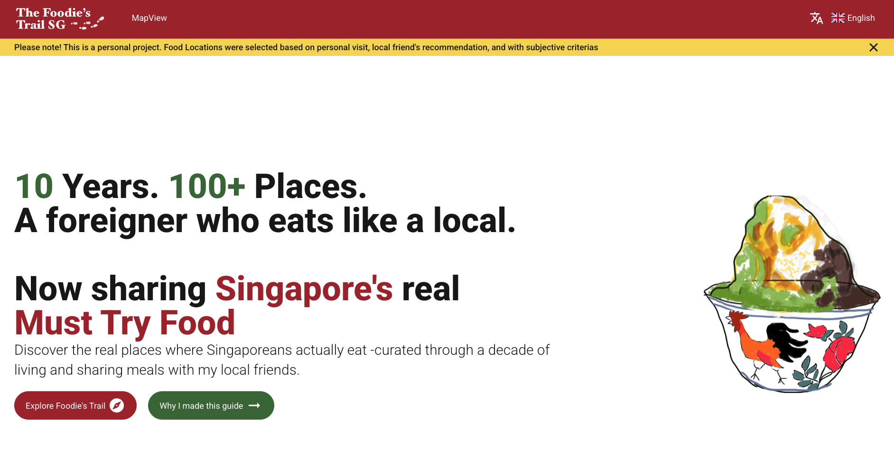

# The Foodie's Trail - SG

*Logo - designed by Gihun Ko*

## Introduction

*The Landing Page gives an adequate explanation of my purpose for building this web app*

This website was created for only one purpose - to introduce tourists who are visiting Singapore hidden local restaurants/dessert/hawker stalls that Singaporeans often visit, but not really known by tourists.

I consider myself a foodie, and whenever I am travelling to a new country, I value experiencing local dishes and places that are frequently visited by the local people. I believe such experience is valuable and gives me new inspiration that I could not think of at my home country.

To travellers who are like me out there around the globe, I would like to present my findings of food lists of Singapore, not just in a format of google map bookmarks, but in a rather more interesting way of presentation; using 3D map representations

## Key Features
- Interactive 3D map of Singapore with explorable food locations
- Discover hidden local restaurants, dessert shops, and hawker stalls
- AI-powered semantic search for finding places
- Trail mode to navigate between multiple locations
- Multi-language support (English, Korean, Japanese, Dutch)
- Day/night theme toggle

## 0. NextJS App with Three.js
This web app also serves purpose for me to brush my frontend development skills, in addition to introducing local food places of Singapore by allowing users to interact in the virtual 3D map of Singapore to explore new hidden gems and locations for food.

*Map Image from wikimedia("Singapore_MRT_Network_(with_Hume)") was used for reference [4.1]*

It was an opportunity for me to pick up new tech stacks such as three.js + DREI components,
as well as to apply the best frontend development practices that I learned while preparing for my job search. More detailed research and analysis is written below.

## 1. Tech Stacks Implemented
* [Next.js 16.1.1](https://nextjs.org/) + [React 19.2.0](https://react.dev/) + [TypeScript 5.x](https://www.typescriptlang.org/)
* [React Three Fiber 9.4.0](https://docs.pmnd.rs/react-three-fiber) + [Drei 10.7.7](https://github.com/pmndrs/drei) + [Three.js 0.181.2](https://threejs.org/) for 3D Canvas Rendering
* [Zustand 5.0.8](https://github.com/pmndrs/zustand) for State Management
* [Tailwind CSS 4](https://tailwindcss.com/) for styling + [clsx](https://github.com/lukeed/clsx)
* [Material UI 7.3.5](https://mui.com/) for UI components
* [next-intl 4.5.7](https://next-intl.dev/) for i18n implementation
* [flag-icons](https://github.com/lipis/flag-icons) for Locale Flags
* Roboto + Public Sans Fonts

**Features:**
- Add, edit, and delete food entries
- Direct integration with GitHub Gist API
- Simple password authentication
- No database required

See [app/admin/README.md](./app/admin/README.md) for setup instructions.

## 3. UI/UX & Research
### 3.1 Colour Theme
I referenced a Straits Times article titled "Singapore in Colour" [4.2], which analysed thousands of photographs taken across Singapore and used computer algorithms to extract the most representative colours of the city. This data-driven approach to understanding Singapore's visual identity inspired the colour palette for this project.

The brand palette consists of four Singapore-inspired colours: **Primary Red** (`#A7292C`) serves as the main accent for call-to-action buttons and primary interactions. **Outram Orange** (`#E15F2B`) brings warmth reminiscent of Singapore's heritage shophouses. **Golden Mile Yellow** (`#F8D64F`) adds highlights and draws attention to key elements. **Garden Green** (`#406E3B`) reflects the city's lush greenery and garden city identity.

For food category differentiation, each type uses a distinct colour: hawker centres are marked in red (`#FF6B6B`), dessert shops in green (`#4CAF50`), and restaurants in orange (`#FF9800`). This colour-coded system allows users to quickly identify and filter locations by category while exploring the 3D map.

### 3.2 CopyRights
All images, 3D models, and external assets used in this project are properly attributed to their original creators. The Singapore MRT map texture is sourced from Wikimedia Commons [4.1]. The 3D rice bowl model is created by bonguyen-um on Sketchfab [4.3]. Please refer to the References section below for full attribution details.

## 4. References Used:
* 4.1 Map Image used for plane texture [Wikimedia] [Singapore_MRT_Network_(with_Hume)](https://commons.wikimedia.org/wiki/File:Singapore_MRT_Network_(with_Hume).svg)
* 4.2 "Singapore in Colour" - by Straits Times [article](https://www.straitstimes.com/multimedia/graphics/2023/08/singapore-in-colour/index.html)
* 4.3 *"[Daily Models 9-24: Bowl of Rice](https://sketchfab.com/3d-models/daily-models-9-24-bowl-of-rice-270655e54e0d412895b2424a01829338)"* 3D Model by bonguyen-um

## Disclaimer
This project is a personal portfolio project and is not affiliated with, endorsed by, or connected to any of the restaurants, hawker centres, or food establishments featured on this platform. All food location recommendations are based solely on the author's personal experiences and preferences. This website is intended for educational and demonstration purposes only.
