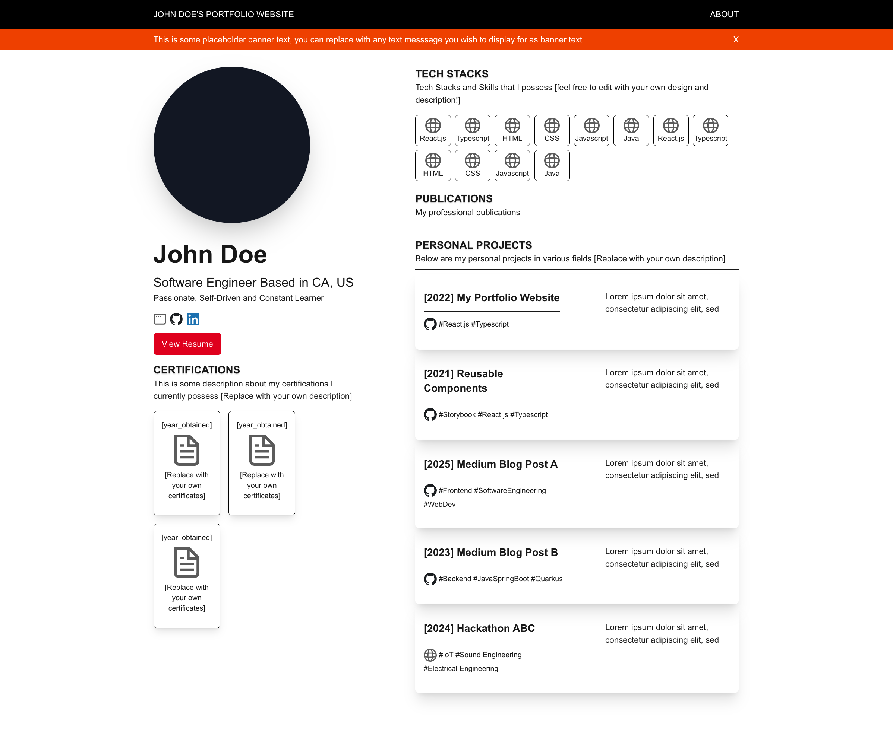

# create-my-website
## Install
```bash
npx create-next-website
```

This is a [Next.js](https://nextjs.org) project bootstrapped with [`create-next-website`](https://github.com/nordic96/create-my-website). The template is built on top with [`create-next-app`](https://nextjs.org/docs/app/api-reference/cli/create-next-app).



The purpose of this template is to provide an easy-to-begin-with structure and initial React Components who are new to React, Typescript and Next.js, and to those who wish to build their own website to display their technical skills over the web.

## Running on Dev Mode

```bash
npm run dev
```

Open [http://localhost:3000](http://localhost:3000) with your browser to see the result.

You can start editing the page by modifying `app/page.tsx`. The page auto-updates as you edit the file.

## Features
* ⚡ Next.js + React 19 + TypeScript

* 🎨 TailwindCSS ready

* 🧩 Modular component structure

* 🧠 SEO-friendly and responsive


## Disclaimer
This template includes brand logos (GitHub, LinkedIn) under their respective trademark guidelines for UI referencing only. These companies do not endorse or sponsor this project.